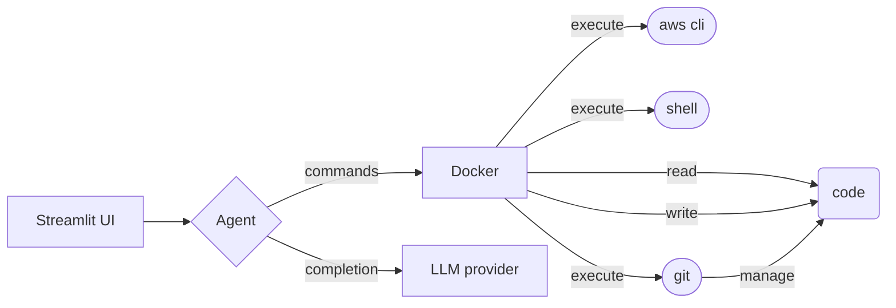

# CREO-CORTEX

## An open-source assistant for building and deploying cloud applications

This repository features a LangGraph ReAct agent with a cmd shell, AWS CLI, and additional tool integrations, designed to help you troubleshoot and develop your code within a controlled environment.

It utilizes a Docker container to provide a secure and predictable execution context for Git, the AWS CLI, and other shell commands.



## Requirements

You must have the following installed:
- Docker
- MongoDB

## Setup

- Create a `.env` file:
```bash
cp .env.example .env
```
- Open and update `.env` file variables

- Create and start a virtual environment:
```bash
pyenv install -v 3.12.3
pyenv virtualenv 3.12.3 creo-cortex-venv
pynev activate creo-cortex-venv
```

- Execute the following commands to build and start the Docker container for the execution context
```
make install
make build
```

### 🐧 Linux notes

If you get permission errors on `make build`, you must add your user to the `docker` group:
```
sudo usermod -aG docker $USER
newgrp docker
make build
```

### ⚠️ AWS & GitHub authentication ⚠️
The `make build` command will attempt to locate your local credentials and bind them as read-only directories to the Docker container, allowing authenticated aws and git cli commands.

See `src/docker_utils/docker_launcher.py :: launch_container` for details.

You must set `DOCKER_AWS_PROFILE` in `.env` to reflect the desired aws profile to use in the Docker context.

## Running

Run the Streamlit front-end application:
```
make run
```


